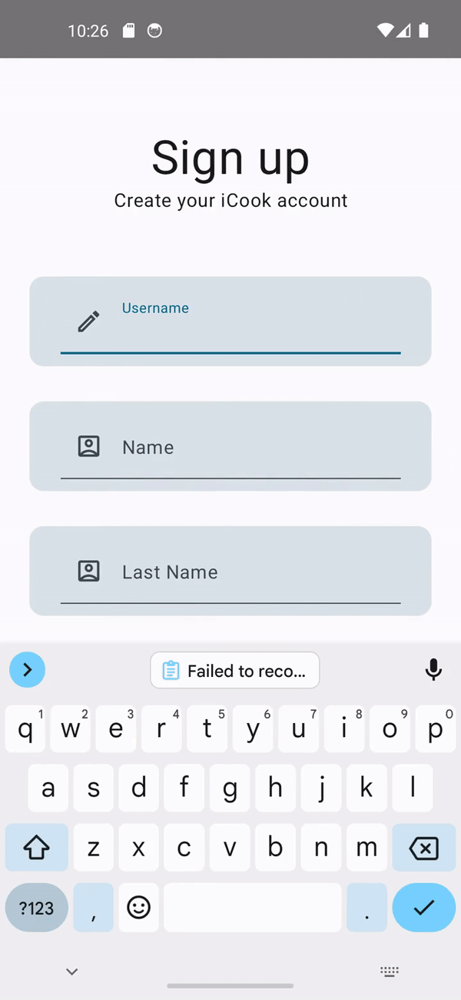
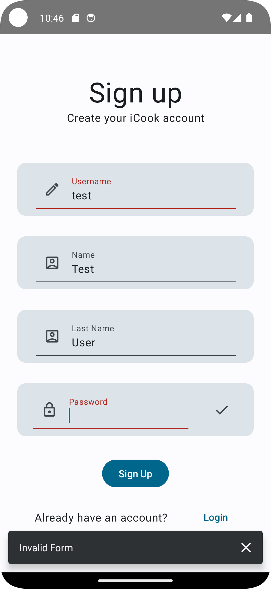
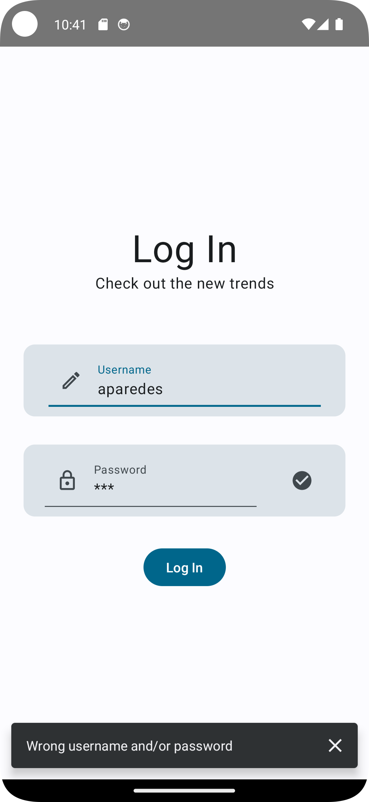
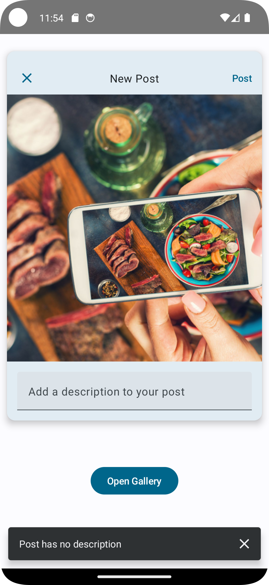
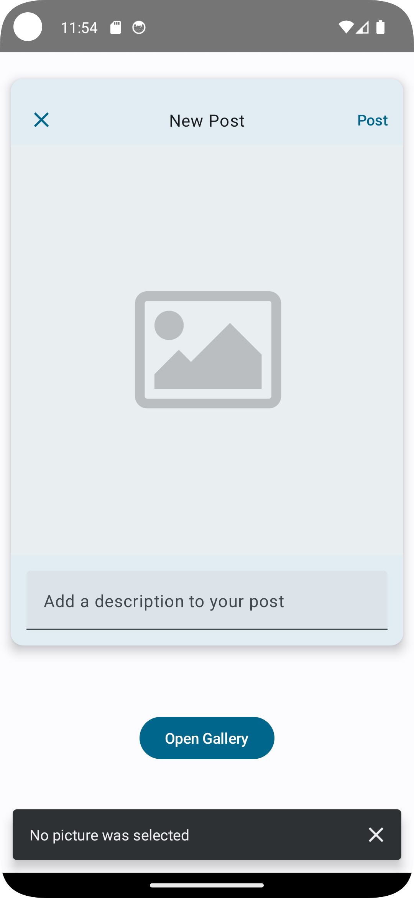

# iCook
A social media Android mobile application (design inspired by Instagram). 

## Technologies:
- Frontend: [Jetpack Compose](https://developer.android.com/jetpack/compose), Android's toolkit for building native UI
- Backend: FlaskRESTX (REST API) and Postgresql (RDBMS)

## Features
### Sign Up to iCook

  
    

### Log In to iCook

  
  

### Update/Customizer your iCook profile

  

### Create a new post

  
  
  

### Check out your Feed Posts, Interact with other posts (like and comment)

  

### Visit other user profiles

  

### Let's log in as another user (aparedes12), check their profile and reply to comments in their posts

  

### Let's log in as another user (aramirez), and check out their feed posts

  

## What I learned

When developing the frontend of an Android application, it's crucial to follow best practices to ensure code maintainability, scalability, and performance. 
Here are some recommended practices to consider:

### 1. Architecture
Choose a robust architecture pattern that separates concerns and promotes maintainability, such as:

- **MVVM (Model-View-ViewModel)**: Helps in maintaining a clear separation of concerns, making code more modular and testable.
- **Clean Architecture**: Encourages separation of concerns into layers, such as domain, data, and presentation layers, promoting testability and maintainability.

### 2. Jetpack Compose Best Practices

Jetpack Compose is a modern toolkit for building native Android UI. Follow these best practices:

- **Compose Navigation**: Utilize the Navigation component for managing navigation between composables.
- **State Management**: Use `remember` and `mutableStateOf` for managing local state within composables.
- **Reusable Components**: Create reusable composables to promote code reusability and maintainability.
- **Theming and Styling**: Utilize theming and styling features of Jetpack Compose to maintain a consistent UI design across the application.

### 3. Code Quality and Organization

- **Single Responsibility Principle (SRP)**: Ensure that each class or function has only one responsibility.
- **Code Organization**: Group related classes, functions, and resources together to improve code readability and maintainability.
- **Naming Conventions**: Follow consistent naming conventions for variables, functions, classes, and resources.
- **Code Documentation**: Document classes, functions, and complex logic to aid understanding and maintainability.

## TODO
### 1. Testing

- **Unit Testing**: Write unit tests for individual functions and classes to ensure they work as expected.
- **UI Testing**: Use tools like Espresso for writing UI tests to ensure proper behavior of UI components.
- **Mocking and Dependency Injection**: Utilize mocking frameworks and dependency injection to isolate components for testing.

### 2. Performance Optimization

- **Network Calls**: Optimize network calls by using techniques like caching, batching, and reducing unnecessary requests.

### 3. Continuous Integration and Deployment (CI/CD)

- **Automated Builds**: Set up CI/CD pipelines to automate builds, testing, and deployment processes.

### 4. Accessibility

- **Accessibility Features**: Ensure your app is accessible to users with disabilities by following accessibility guidelines and best practices.

### 5. Internationalization and Localization

- **Internationalization (i18n)**: Design your app to support multiple languages and cultures.

